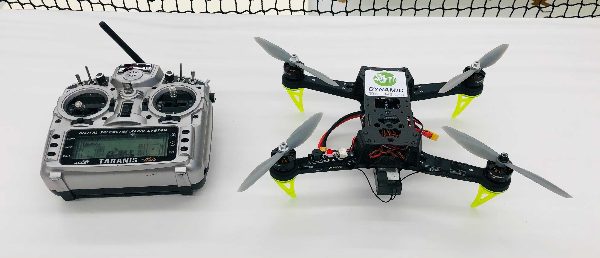
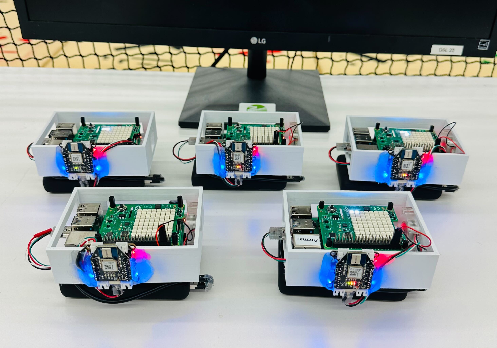

## Short Bio

Hello, welcome to my homepage! 

I am Wenda Zhao, a Ph.D. candidate in the [Learning System and Robotics Lab][dsl] at the [University of Toronto Institute for Aerospace Studies (UTIAS)][utias] and [Technische Universität München (TUM)][tum] under Professor [Angela P. Schoellig][Angela_link]. I am also a Postgraduate Affiliated researcher at the [University of Toronto Robotics Institute][RI] and [Vector Institute][VI] (Toronto, ON, Canada) and [Munich Institute of Robotics and Machine Intelligence (MIRMI)][mirmi] (Munich, Bavaria, Germany). Before coming to Toronto, I earned a MASc degree in Electrical & Computer Engineering (ECE) from [Tongji University][tju] in Shanghai, China in 2018. In the summer of 2016, I had the opportunity to attend the exchange program at [RWTH Aachen University][rwth], Germany. 

My research interests lie at the intersection of state estimation and machine learning for mobile robotics. Meanwhile, I enjoy robotics hardware and software co-design. I am fascinated by the ability of robots to sense and interact with the physical world, which reminds us of the beauty and wonder that exist in nature.

## Current Research

- Bayesian Estimation and Variational Inference
- Robust non-Gaussian Inference and Optimization 
- Factor Graph-based State Estimation

## Current Projects

- Robust filtering and learning-based Ultra-wideband (UWB) bias correction ([Blog1: bias learning][bias-learning], [Blog2: robust filtering][robust-filtering])
- Large-scale UWB-based localization system design
- Robust state estimation for mobile robots
- Relative localization and coordination for swarm robots 

## Open Source Projects
- M-estimation based robust Kalman filter for UWB TDOA measurements. [PR #707, (merged)][PR-707] Included in the [Bitcraze Code Release 2021.03][release-202103]
- M-estimation based robust Kalman filter for UWB TWR measurements. [PR #745, (merged)][PR-745] Included in the [Bitcraze Code Release 2021.06][release-202106]
- UTIL: Ultra-wideband Dataset ([webpage][uwb-dataset])

## Teaching

- Teaching Assistant for [AER 1217H, Development of Autonomous UAS][aer1217] at UTIAS, 2019 ~ 2023.  
Responsible for designing course materials, involving quadrotor PID controller, vision-based georeferencing, stereo camera visual odometry, and path planning algorithms. 

- Undergraduate EngSci Thesis Supervision:   
Multi-Quadrotor Cooperative Fight with UWB-aided Relative State Estimation and Control. ([video][relative_loc])  [Xinyuan Sam Qiao][Sam_linkedin], EngSci 2T2 Robotics Option.   
M.A.Sc. student (2023) under Professor [Timothy D. Barfoot][Tim_link].

## First-Author Publications

- **Wenda Zhao&dagger;**, Abhishek Goudar&dagger;, Mingliang Tang&dagger;, and Angela P. Schoellig, Ultra-wideband Time Difference of Arrival Indoor Localization: From Sensor Placement Analysis to System Evaluation - IEEE Robotics and Automation Magazine (RA-M), 2024. (&dagger; : equal contribution) [under review].

- **Wenda Zhao**, Abhishek Goudar, Mingliang Tang, Xinyuan Qiao, and Angela P. Schoellig, Uncertainty-aware Gaussian Mixture Model for UWB Time Difference of Arrival Localization in Cluttered Environments - IEEE/RSJ International Conference on Intelligent Robots and Systems (IROS), 2023. [[paper][iros23_arxiv]]. 

- **Wenda Zhao**, Abhishek Goudar, Xinyuan Qiao, and Angela P. Schoellig, UTIL: An Ultra-wideband Time-difference-of-arrival Indoor Localization Dataset - International Journal of Robotics Research (IJRR), 2024. [[paper][ijrr_dataset_arxiv]], [[webpage][uwb-dataset]]. 

- **Wenda Zhao**, Abhishek Goudar, and Angela P. Schoellig, Finding the Right Place: Sensor Placement for UWB Time Difference of Arrival Localization in Cluttered Indoor Environments - IEEE Robotics and Automation Letters (RA-L), presented at ICRA, 2023. [[paper][ral22_icra23_arxiv]].

- **Wenda Zhao**, Jacopo Panerati, and Angela P. Schoellig, Learning-based Bias Correction for Time Difference of Arrival Ultra-wideband Localization of Resource-constrained Mobile Robots - IEEE Robotics and Automation Letters (RA-L), presented at ICRA, 2021. [[paper][ral_icra21_arxiv]].

- **Wenda Zhao**, Marijan Vukosavljev, and Angela P. Schoellig, Optimal Geometry for Ultra-wideband Localization using Bayesian Optimization - International Federation of Automatic Control (IFAC) World Congress, 2020. [[paper][ifac20]].

- **Wenda Zhao**, Yongqing Su, Jiguang Yue, Huihua Mu, and Xuejiao Liu, Fragility Analysis and Weak Point Identification of Power Systems - In AOPC 2017: 3D Measurement Technology for Intelligent Manufacturing, 2017. [[paper][spie_17]].

## Collaborated Publications

- Abhishek Goudar, **Wenda Zhao**, and Angela P. Schoellig, Range-visual-inertial sensor fusion for micro aerial vehicle localization and navigation - IEEE Robotics and Automation Letters (RA-L), 2023. [[paper][rvi_ral23]].

- Abhishek Goudar, **Wenda Zhao**, Timothy D. Barfoot, and Angela P. Schoellig, Gaussian Variational Inference with Covariance Constraints Applied to Range-only Localization - IEEE/RSJ International Conference on Intelligent Robots and Systems (IROS), 2022. [[paper][iros22]].

- Siqi Zhou, Karime Pereida, **Wenda Zhao**, and Angela P. Schoellig, Bridging the Model-Reality Gap with Lipschitz Network Adaptation - IEEE Robotics and Automation Letters (RA-L), presented at ICRA, 2022. [[paper][ral_icra_22]].

- Navid Kayhani, **Wenda Zhao**, Brenda McCabe, and Angela P. Schoellig, Tag-based Visual-inertial Localization of Unmanned Aerial Vehicles in Indoor Construction Environments using an On-manifold Extended Kalman Filter - Automation in Construction, 2022. [[paper][auto_con_22]].

- Navid Kayhani, Adam Heins, **Wenda Zhao**, Mohammad Nahangi, Brenda McCabe, and Angela P. Schoellig. Improved tag-based indoor localization of UAVs using extended Kalman filter - International Symposium on Automation and Robotics in Construction (ISARC), 2019. [[paper][isarc_19]].

## Life

### Video Editing 
Christmas Video (2020)
") 

Welcome to the Dynamic Systems Lab (2018)
") 
### Customized Robot Platform 
A fleet of customized drones with CF-Bolt flight controller.

Customized quadrotor platform with Pixhawk flight controller.

UWB-Inertial handheld device with Raspberry Pi 4B.

&nbsp;

## Contact Information and Links

- Contact me via email:   
  **wenda.zhao@robotics.utias.utoronto.ca**
- Links: [LinkedIn][1], [Google Scholar][2], [GitHub][3]
<!-- - [Resume][cv] -->

 

    

 

[1]:https://linkedin.com/in/wenda-zhao-uitas-vector-robotics123
[2]:https://scholar.google.com/citations?user=iuxmmX8AAAAJ&hl=en
[3]:https://github.com/Williamwenda
[utias]:https://www.utias.utoronto.ca/
[tum]: https://www.tum.de/en/
[mirmi]: https://www.mirmi.tum.de/en/mirmi/home/
[dsl]:http://www.dynsyslab.org/
[VI]:https://vectorinstitute.ai/
[RI]:https://robotics.utoronto.ca/
[tju]:https://www.tongji.edu.cn/eng/
[rwth]:https://www.rwth-aachen.de/go/id/a/?lidx=1
[aer1217]:https://www.utias.utoronto.ca/graduate-students/course-descriptions/
[bias-learning]:https://www.bitcraze.io/2020/04/learning-based-bias-correction-for-accurate-ultra-wideband-localization-of-a-crazyflie/
[robust-filtering]:https://www.bitcraze.io/2021/06/robust-kalman-filter-for-ultra-wideband-localization/
[release-202103]:https://github.com/bitcraze/crazyflie-firmware/releases/2021.03
[release-202106]:https://github.com/bitcraze/crazyflie-firmware/releases/2021.06
[PR-707]:https://github.com/bitcraze/crazyflie-firmware/pull/707
[PR-745]:https://github.com/bitcraze/crazyflie-firmware/pull/745
[uwb-dataset]:https://utiasdsl.github.io/util-uwb-dataset/
[Sam_linkedin]: https://www.linkedin.com/in/xinyuan-sam-qiao-8b15ba17a/?originalSubdomain=ca
[Angela_link]: https://www.dynsyslab.org/prof-angela-schoellig/
[Tim_link]: http://asrl.utias.utoronto.ca/~tdb/

[iros23_arxiv]: https://arxiv.org/abs/2307.16848
[ijrr_dataset_arxiv]: https://arxiv.org/abs/2203.14471v4
[ral22_icra23_arxiv]: https://arxiv.org/abs/2204.04508
[ral_icra21_arxiv]: https://arxiv.org/abs/2103.01885
[ifac20]: https://www.sciencedirect.com/science/article/pii/S2405896320330433
[spie_17]: https://www.spiedigitallibrary.org/conference-proceedings-of-spie/10458/2282824/Fragility-analysis-and-weak-point-identification-of-power-system/10.1117/12.2282824.full?SSO=1

[iros22]: https://ieeexplore.ieee.org/document/9981520
[ral_icra_22]: https://arxiv.org/abs/2112.03756
[auto_con_22]: https://www.sciencedirect.com/science/article/pii/S092658052100563X
[isarc_19]: https://www.iaarc.org/publications/2019_proceedings_of_the_36th_isarc/improved_tag_based_indoor_localization_of_uavs_using_extended_kalman_filter.html

[rvi_ral23]: https://ieeexplore.ieee.org/stamp/stamp.jsp?arnumber=10325583

[relative_loc]: https://youtu.be/7EYpe-nck58