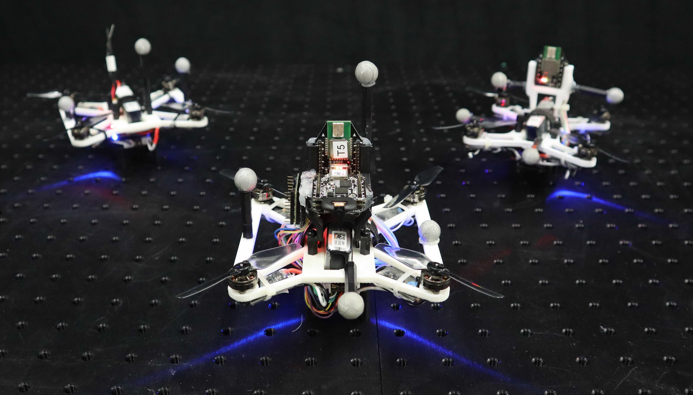

## Short Bio

Wenda Zhao is a Ph.D. candidate in the [Dynamic System Lab (DSL)][dsl], [University of Toronto Institute for Aerospace Studies (UTIAS)][utias]. He is also a Postgraduate Affiliated researcher at [University of Toronto Robotics Institute][RI] and [Vector Institute][VI] (Toronto, ON, Canada). He received a MASc degree in Electrical & Computer Engineer (ECE) from [Tongji University][tju] (Shanghai, China) in 2018. In 2016, he attended the exchange program in Robotics Technology at [RWTH Aachen University][rwth] (Aachen, Germany). 

## Current Research

- Bayesian estimation and statistical inference
- Robust non-Gaussian inference  
- Factor graphs for state estimation
- Neural network enhanced localization

## Current Projects

- Robust filtering and learning-based Ultra-wideband (UWB) bias correction ([Blog1: bias learning][bias-learning], [Blog2: robust filtering][robust-filtering])
- Large-scale UWB-based localization system design
- Robust sensor fusion for indoor localization
- Relative localization and control for swarm robotics 

## Open Source Projects
- M-estimation based robust Kalman filter for UWB TDOA measurements. [PR #707, (merged)][PR-707] Included in the [Bitcraze Code Release 2021.03][release-202103]
- M-estimation based robust Kalman filter for UWB TWR measurements. [PR #745, (merged)][PR-745] Included in the [Bitcraze Code Release 2021.06][release-202106]
- UTIL: Ultra-wideband Dataset ([webpage][uwb-dataset])

## Teaching

- At *University of Toronto Institute for Aerospace Studies (UTIAS)*:    teaching assistant for [AER 1217H, Development of Autonomous UAS][aer1217]. 

Responsible for designing course materials, involving quadrotor PID controller, vision-based georeferencing, stereo camera visual odometry, and path planning algorithms. 

## Selected Publications

- Abhishek Goudar, **Wenda Zhao**, and Angela P. Schoellig, Guaranteeing Positive Definiteness of the Inverse Covariance Matrix in Gaussian Variational Inference for State Estimation - IEEE/RSJ International Conference on Intelligent Robots and Systems (IROS), 2022 (Accepted)

- **Wenda Zhao**, Abhishek Goudar, Xinyuan Qiao, and Angela P. Schoellig, UTIL: An Ultra-wideband Time-difference-of-arrival Indoor Localization Dataset - International Journal of Robotics Research (IJRR) Dataset, 2022 (Under review)

- **Wenda Zhao**, Abhishek Goudar, and Angela P. Schoellig, Finding the Right Place: Sensor Placement for UWB Time Difference of Arrival Localization in Cluttered Indoor Environments - IEEE Robotics and Automation Letters (RA-L), 2022

- Siqi Zhou, Karime Pereida, **Wenda Zhao**, and Angela P. Schoellig, Bridging the Model-Reality Gap with Lipschitz Network Adaptation - IEEE Robotics and Automation Letters (RA-L), presented at ICRA, 2022

- Navid Kayhani, **Wenda Zhao**, Brenda McCabe, and Angela P. Schoellig, Tag-based Visual-inertial Localization of Unmanned Aerial Vehicles in Indoor Construction Environments using an On-manifold Extended Kalman Filter - Automation in Construction, 2022

- **Wenda Zhao**, Jacopo Panerati, and Angela P. Schoellig, Learning-based Bias Correction for Time Difference of Arrival Ultra-wideband Localization of Resource-constrained Mobile Robots - IEEE Robotics and Automation Letters (RA-L), presented at ICRA, 2021

- **Wenda Zhao**, Marijan Vukosavljev, and Angela P. Schoellig, Optimal Geometry for Ultra-wideband Localization using Bayesian Optimization - International Federation of Automatic Control (IFAC) World Congress, 2020

- **Wenda Zhao**, Yongqing Su, Jiguang Yue, Huihua Mu, and Xuejiao Liu, Fragility Analysis and Weak Point Identification of Power Systems - In AOPC 2017: 3D Measurement Technology for Intelligent Manufacturing, 2017

## Life

### Video Editing 
Christmas Video (2020)
") 

Welcome to the Dynamic Systems Lab (2018)
") 
### Customized Quadcopters Design
A fleet of customized quadrotors.

&nbsp;

## Contact Information and Links

- Contact Wenda:   
  **wenda {dot} zhao {at} robotics {dot} utias {dot} utoronto {dot} ca**
- Or find him on [LinkedIn][1], [GitHub][2]
<!-- - [Resume][cv] -->

 

    <!--  -->
    

 

[1]:https://www.linkedin.com/in/wenda-zhao-648ab8138/
[2]:https://github.com/Williamwenda

[utias]:https://www.utias.utoronto.ca/
[dsl]:http://www.dynsyslab.org/
[VI]:https://vectorinstitute.ai/
[RI]:https://robotics.utoronto.ca/
[tju]:https://www.tongji.edu.cn/eng/
[rwth]:https://www.rwth-aachen.de/go/id/a/?lidx=1
[aer1217]:https://carre.utoronto.ca/aer1217
[bias-learning]:https://www.bitcraze.io/2020/04/learning-based-bias-correction-for-accurate-ultra-wideband-localization-of-a-crazyflie/
[robust-filtering]:https://www.bitcraze.io/2021/06/robust-kalman-filter-for-ultra-wideband-localization/
[release-202103]:https://github.com/bitcraze/crazyflie-release/releases/tag/2021.03
[release-202106]:https://github.com/bitcraze/crazyflie-release/releases/tag/2021.06
[PR-707]:https://github.com/bitcraze/crazyflie-firmware/pull/707
[PR-745]:https://github.com/bitcraze/crazyflie-firmware/pull/745
[uwb-dataset]:https://utiasdsl.github.io/util-uwb-dataset/